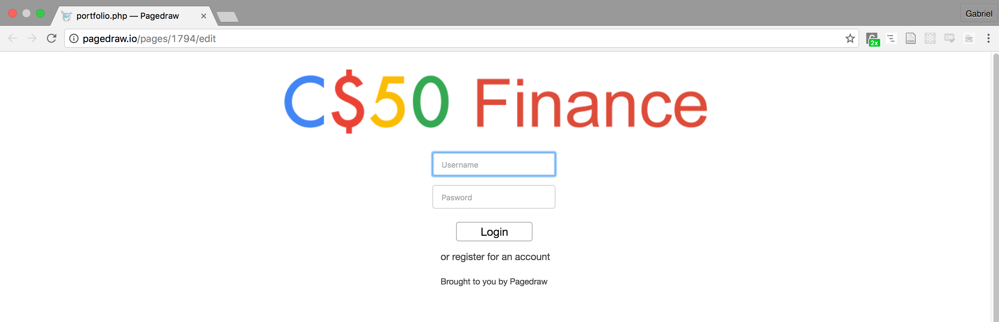
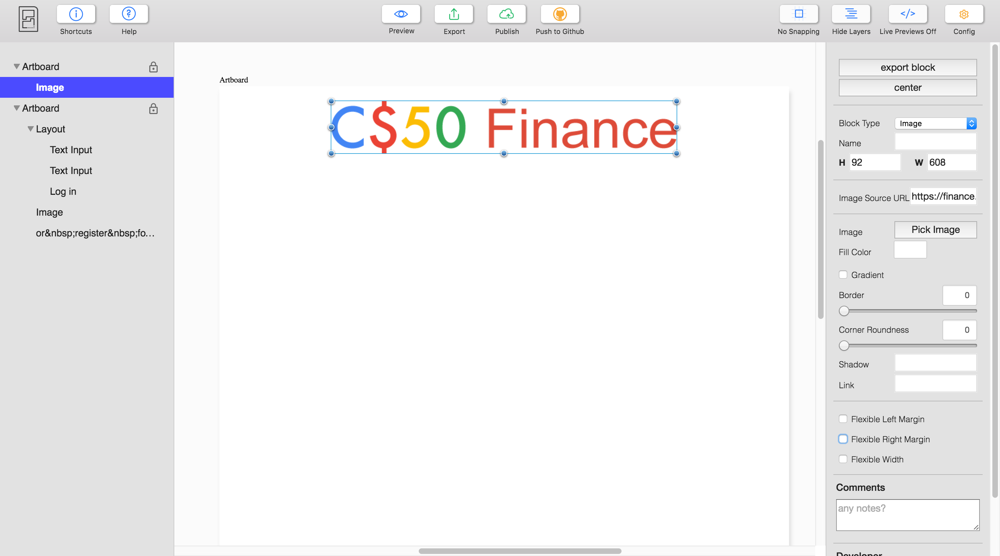
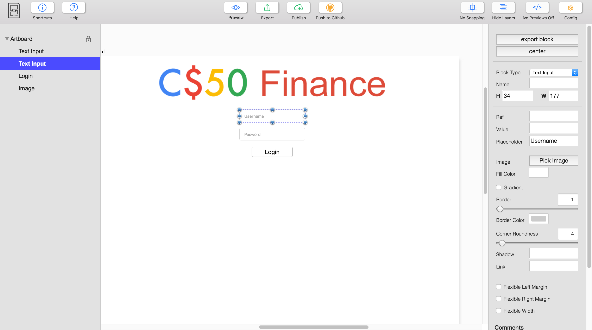
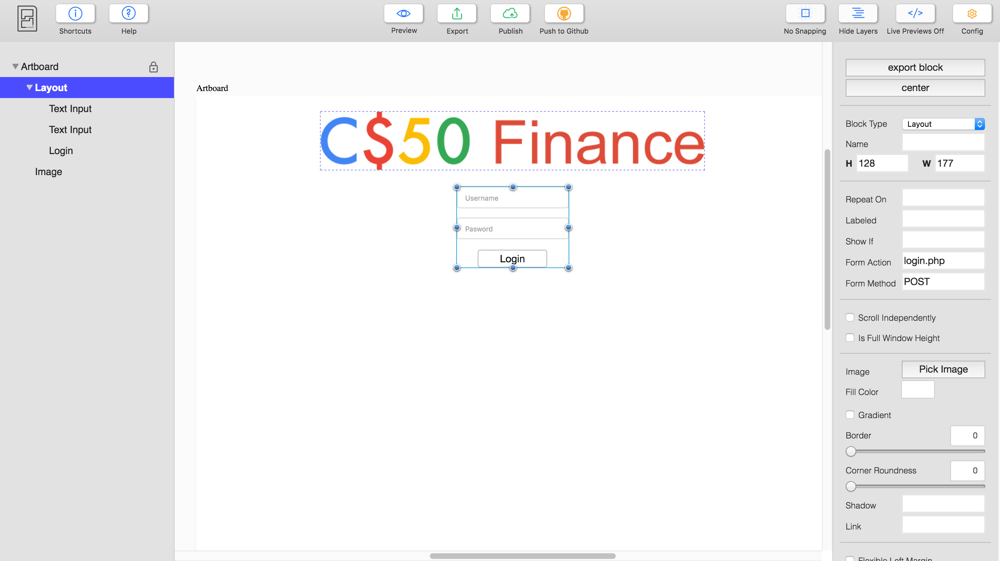
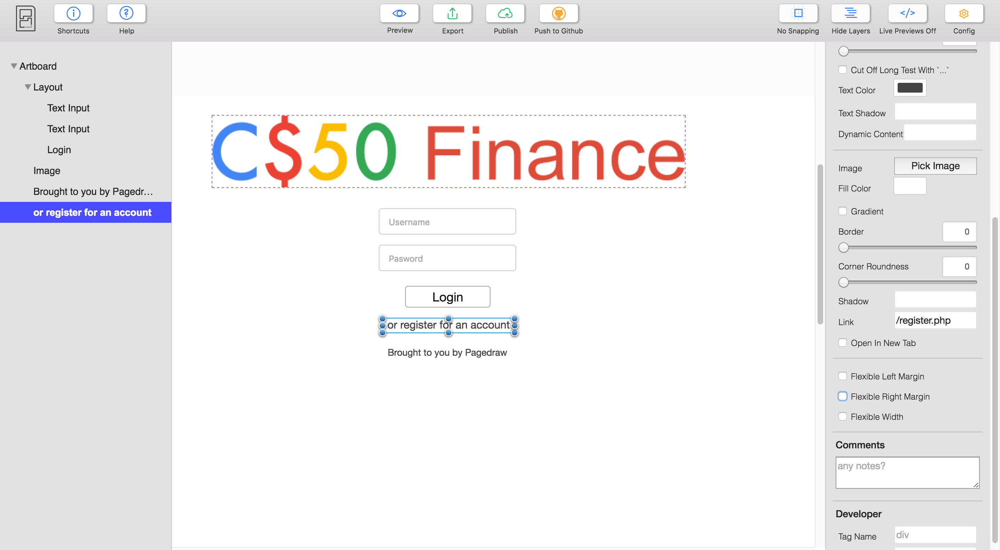

CS50 Finance in Pagedraw
=

This guide is going to walk you through creating parts of CS50 Finance (Pset 7) in Pagedraw. This is a great starting point if
you want to use Pagedraw to build your CS50 final project. Here's what we're gonna build



The idea of Pagedraw is that you still have to
write the code responsible for your app's logic (the model and the controller), but you can build the user
interface (the view) entirely in Pagedraw, without writing any code. In the end, Pagedraw is going to compile the design
you created into fully semantic Python + HTML/CSS (or Rails, React, etc) that works across browsers and screen sizes. Isn't that cool?!

Now, let's dive right in.

0. Before we begin, let's talk about Artboards
-

Every Pagedraw document needs at least one `Artboard`. An Artboard is just another block with a special trick:
everything that you put inside of it is going to be compiled to frontend code! Multiple artboards correspond to
multiple screen sizes (i.e. a web-mobile version). So please go
ahead and create just one Artboard block for now.

Once you're satisfied with the size of your artboard, it might be a good idea to lock it via the little lock icon in the
left sidebar. This will prevent you from accidentally dragging it around.

1. Add the CS50 Finance logo
-

Simply use Shift + Drag to create a new block inside of our artboard. All blocks start out as layout blocks, but you can
change that via the `Block Type` menu on the right sidebar.

Change this first block to be an `Image` block and copy the URL
```https://finance.cs50.net/img/logo.png```
into the `Image Source URL` field. Another option is to upload any image file using `Pick Image`. Now, everything should look like this:



2. Adding Login form
-

Now let's make our login form! Go ahead and add two `Text Input` blocks and one `Button` block. After some styling, mine
look like this:



Now we have to add `Ref=username` and `Ref=password` to both `Text Input` blocks. This is the moral equivalent of
something like

```<input name="username" />```

in HTML. The ref has to be there so our form knows via which key to send the value typed into that input.

Finally we need to add the form itself. If you select the three inputs we just created and click on `Wrap` on the right,
a new transparent layout block will be created around the inputs. We just fill in `login.php` for `Form Action` and
`POST` for `Form Method`. The final result:




3. Adding some text
-

To finish up our login page, let's add some text at the bottom, per the CS50 original example. Create two `Text` blocks
and double click on each of them to add text. In the first one, we also added a link to `/register.php`. Our artboard
looks like this:





4. Making sure everything stays in the center
-

You can press the button `center` to center any block within its parent. But this won't make
it centered for all screen sizes. Click on `Preview` to notice that. In order to make a block always centered, we have to
check the two checkboxes `Flexible Left Margin` and `Flexible Right Margin` on the right sidebar.


Try to do that for the logo first. Since both of the logo's margins have the same size in
the Artboard, making both flexible is going to make them shrink and grow equally, keeping your content nicely centered.

Now if you click `Preview` again, the logo should be centered no matter the screen size. Repeat the steps above with the form block and the text blocks. Now, everything should be centered!
