CS50 Final Project in Pagedraw
=

Pagedraw is a tool that lets you **draw your ideas** on a canvas, and then compiles your drawings into fully semantic, production-ready frontend code (HTML/CSS/Jinja).

That basically **cuts in half the amount of actual code that you have to write** for the Final Project, letting you focus on the juicy design/backend parts of your app so you can create something even more awesome.

This is a step by step guide on how to use Pagedraw to build the frontend of your CS50 Final Project. We're going to
create a social network for Hamsters called myFace that lists posts with photos and descriptions and lets the user add
new posts. At the end we'll have a working app that looks something like this:

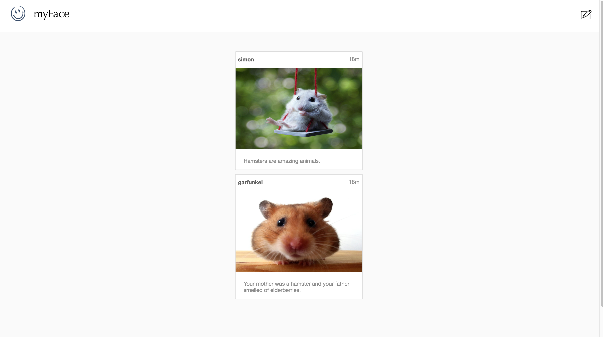

Make sure you're using Google Chrome, since that's the only browser supported by Pagedraw right now.

0. Install the Pagedraw-Cloud9 integration plugin.
-

This will make your pagedraw designs automatically sync with your project in cloud9. You can find the installation
instructions [here](cloud9.md).

Refresh your Cloud9 IDE and make sure you see the message below before proceeding.

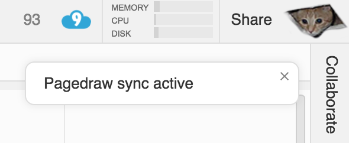

1. Use the Pset7 Finance framework as a skeleton for your web app.
-

Pagedraw automatically generates frontend code - the view - for you, but you
still need to write the backend - the model and the controller - of your app. This guide assumes you're using the CS50 Pset7 code as a skeleton for your
app. In order to do that, execute the following commands in a terminal window in the IDE (assuming you're in `~/workspace`):

```
wget https://github.com/Pagedraw/flask-app/raw/master/project.zip
unzip project.zip
rm -f project.zip
cd ~/workspace/project
```

Now you have a folder called `~/workspace/project/` containing a slightly modified version of the Pset7 distribution code. You'll use this as a
skeleton for your
backend. The Python backend is going to define all of the routes
of your web app and, for each route, generate some data and pass it to `render_template`, which, well, renders
templates! The templates
are the frontend files that Pagedraw creates.

The backend doesn't know (and doesn't care) that you're using Pagedraw, which means that the work you have to do on the
backend (everything that lives inside `application.py`) should be the exact same with or without Pagedraw (and similar in spirit to what you did for Pset7!).


2. Creating a Hello World page in Pagedraw
-

Head to [https://pagedraw.io](https://pagedraw.io), login, and create a new page called `index`. In
the Pagedraw editor you now have to link the page's File Path (in the "Document Selected" sidebar) to
`~/workspace/project/templates/index.html`. Make sure to set the full path. A File Path with just `index.html` won't work.

At this point, check that Pagedraw has already created `~/workspace/project/templates/index.html` in your IDE automatically. From
now on, any changes that you do in the Pagedraw editor for this page will be automatically written to that template
file. That means you cannot change `index.html` in the CS50 IDE. All frontend changes have to be done in Pagedraw.

Right now our newly created page is empty, so let's bring it to life by creating an Artboard. Use Shift + drag to draw a
block and select `Artboard` from the `Block Type` menu on the right. Every Pagedraw page needs at least one Artboard.
Everything you place inside of it is going to be automatically compiled into frontend code and everything outside of
the artboard is gonna be ignored by the compiler.

Once you're satisfied with the size of your artboard (I used height=400 and width=700), it might be a good idea to lock it via the little lock icon in
the
layer list on the left (hover over the Artboard entry to see it, per the below). This will prevent you from accidentally dragging the artboard around.

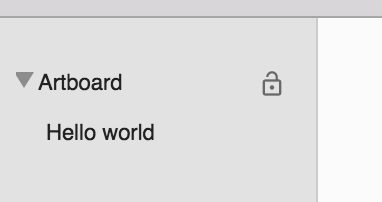

Just to start, create another block inside of the artboard but this time make it a `Text Block`. Double click the Text
block to edit it and add `Hello, World!`. Everything should look like this:

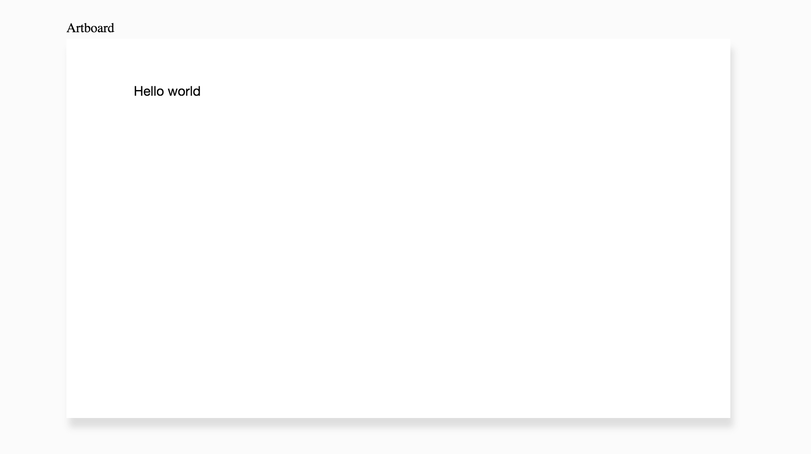

Now we're done with the frontend part of our Hello World page. Let's turn our attention to the backend part. In the CS50 IDE, add the following
to `~/workspace/project/application.py`

```
@app.route("/")
def index():
    return render_template("index.html")
```

this route simply calls the template `hello.html` created by Pagedraw. Make sure you save the change to `~/workspace/project/application.py`. Again, this is just like what you did for Pset7,
except that Pagedraw automatically created the `hello.html` file. You didn't have to write any HTML/CSS/Jinja (recall Jinja is the name of the templating language used by Python/Flask). Isn't that cool?!

Now you just have to spin up the Flask server by running `flask run` within `~/workspace/project/` (just like you did
for Pset7). Now if you go to the url `ide50-yourusername.cs50.io/` you should be seeing your newly created Hello
World page!


3. Index page
-

Now let's turn our `index.html` page into something more interesting. Double click the text block you created above and
change its content to "myFace," the name of our app. Let's also style this text a bit and change the `Font Size` to 26
and the `Font` to `Candara`.

Now let's add our first image! To add an image, do the same thing you did when you added a text block, but this time choose `Image Block` as the type.
Now copy the URL
```https://ucarecdn.com/0826ede0-dbd1-419a-8bd4-2800afc04c2c/```
into the `Image Source URL` field. Another option is to upload any image file using `Pick Image`. This is gonna add a
smiley face to your page.

Finally add a second image from the URL
```https://d30y9cdsu7xlg0.cloudfront.net/png/196302-200.png```
This will become a link later. Resize and move everything so it looks like this:

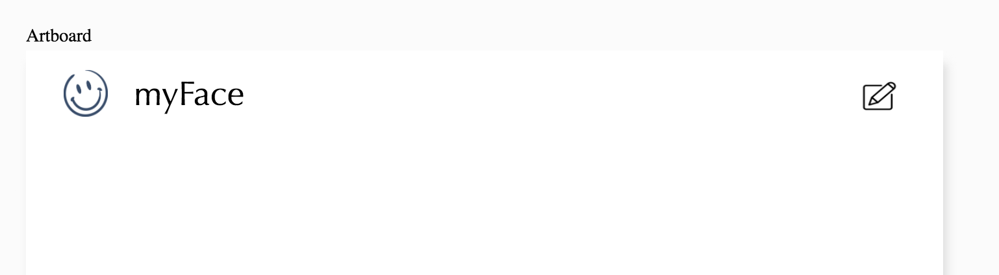

To make the page a little bit more interesting lets add a gray background to the content area. Make a layout block with
the fill color `#FAFAFA` occupying the bottom 4/5 of the artboard. Add another very thin layout block right above it, as a separation line. I'm using fill
color `#D8D8D8` for the line. Everything should look like this

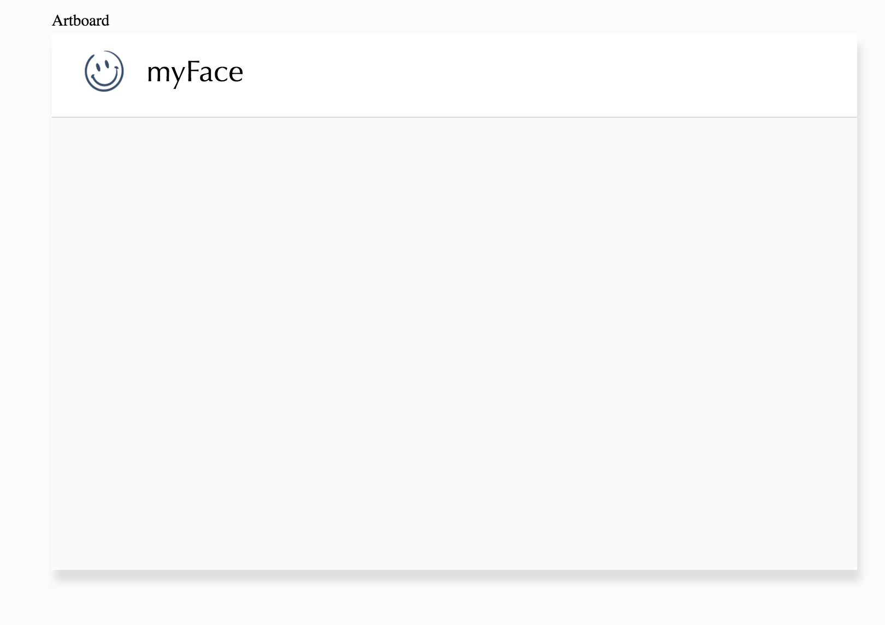

At this point, you might have already seen some dashed red lines around your blocks like the following

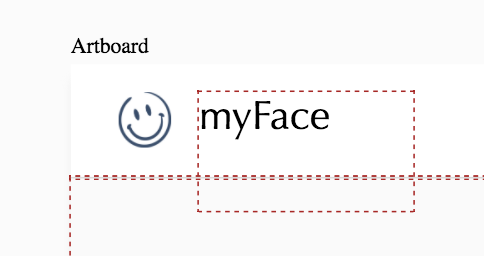

Pagedraw doesn't fully handle overlapping blocks yet, so make sure you resize and move your blocks to prevent any red dashed lines from
appearing. It's totally fine for blocks to touch but it's not fine for blocks to overlap. For more information on overlapping blocks and how to get around this limitation, check our [FAQ](faq.md).

Now take a minute to look at the generated code below inside `~/workspace/project/templates/index.html`. Without Pagedraw, you'd have to write
all of those almost 200 lines of HTML + CSS by hand. And this is just for one page that we haven't quite finished yet. The beauty of Pagedraw is that the generated code is not hackish or bad in any way. Disconsidering the `pd-1087-3-2-1` class names, everything else is very similar to the code that a developer would write by hand.

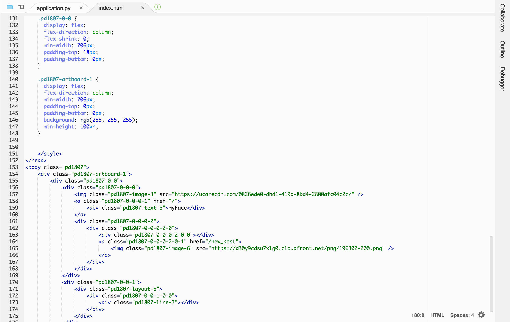

4. Adding posts
-

Now lets use what you just learned to add a list of posts to your app. Add a white layout block, an image block with a
hamster (Link to cute Hamster: http://static.boredpanda.com/blog/wp-content/uploads/2015/09/cute-hamsters-23__880.jpg),
and three text blocks to get something like this:

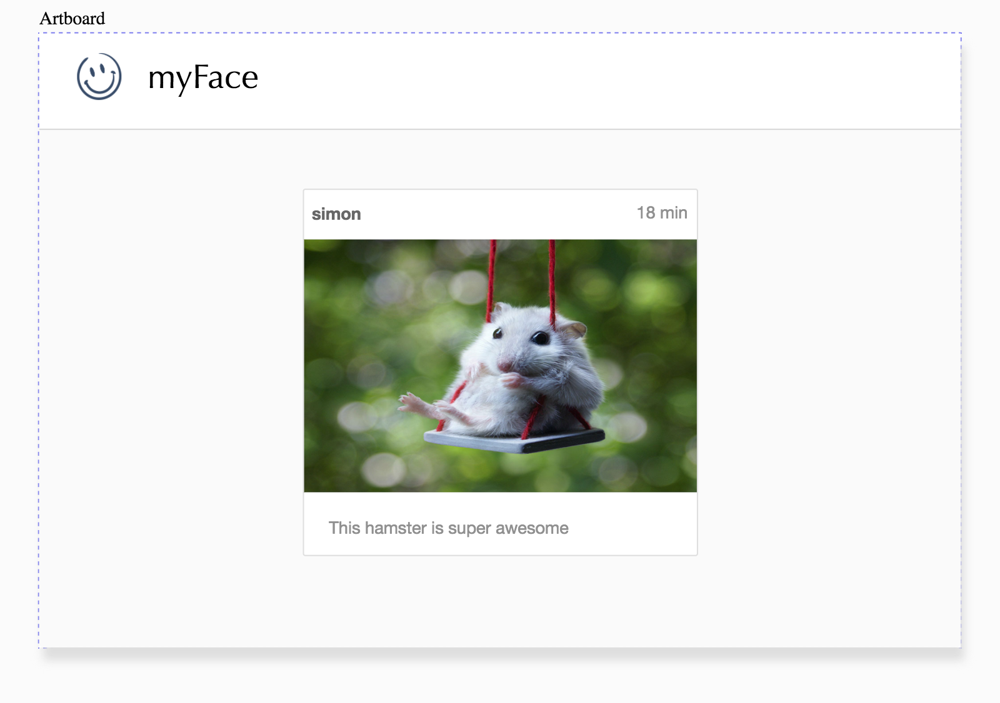

Note that in order for the image to be displayed "on top" of the white block, it must be smaller than the white block. That's how we figure out which block goes in front right now. Also, I used a border of 1px and color `#DFDFDF` around the white layout block as well as a corner roundness of 3. For the
text I used the color `#909090` for light gray and `#676767` for dark gray, with the dark gray name in bold.

Of course this content is not dynamic yet, which means that every user will see the exact same post no matter what.
That's boring. Let's turn this into a list of posts coming from a database instead.

Select the white layout block in the center and type in `posts` and `post` in the fields `Repeat On` and `Labeled`,
respectively. Also make sure you add a `Space between` of 10 or so, to ensure that there is some spacing between each of the repeated elements.

Pagedraw is going to generate code that repeats that block in a `for post in posts` fashion. We will make sure our backend gives us a list of posts in step 5. For now let's
add dynamic content inside of each post.

If you use handlebar notation (`{{'Hello World'}}`) anywhere in Pagedraw, we go into "backend mode" compiling whatever is
inside of the double curly braces into Jinja template code. Now click on the block that says `simon` and add
`{{post['username']}}` for its dynamic content per the following

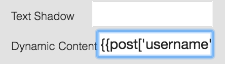

Do the same for the `18 min` and `This hamster is super awesome` text blocks
adding `{{post['time']}}` and `{{post['description']}}` as their respective dynamic contents.

Finally we must also make the image of each post be dynamic. Add `{{post['img_src']}}` to the
Dynamic Source URL field of the image of each post. In the editor you should see no changes (still the same hamster you added before), but
in the generated code, the actual Image Source attribute is coming from the varible `post['img_src']`

5. Adding a backend route for the index page
-

We are now done with the basic frontend of this page. Let's add a route to `~/workspace/project/application.py` to see it
in action. Replace the route you made in the Hello World example by

```
def minutes_elapsed(time_string):
    return int((datetime.now() - datetime.strptime(time_string, '%Y-%m-%d %H:%M:%S')).total_seconds() / 60)

@app.route("/")
def index():
    # Our app only supports Gabe as a user right now...
    current_user = 'gabe'

    # Fetch posts from Database
    posts = db.execute("SELECT * FROM posts")
    for post in posts:
        # Add username to every post and format the time in the way we want to display it
        post['username'] = current_user
        post['time'] = str(minutes_elapsed(post['time'])) + 'm'

    # Reverse list so the newest post is showed first
    posts.reverse()

    return render_template("index.html", posts=posts)
```

This simply fetches all posts from the database, converts the timestamp of each post into the number of minutes elapsed and adds
a default user `gabe` to all of the posts (our app only supports one user for simplicity). In order for that to work, you need a table called `posts` in your database with the fields `img_src`, `description`, and `time`.

Again, remember that `return render_template("index.html", posts=posts)` is actually rendering the index.html page that Pagedraw automatically generated and placed in `~/workspace/project/templates/index.html` and passing a list of posts to the template, which we invoked in Pagedraw in step 4.

Now make sure your server is running via `flask run` and click on **CS50 IDE > Web Server**. You should see your newly created page working! Yay. Isn't that awesome?

You probably noticed that, although the page "works," it doesn't resize as you would expect. That's because we need to add constraints to explain to Pagedraw how you'd like your page to resize. Ok. Back to Pagedraw for the next step...

6. Constraints - Making sure everything resizes
-

You can press the button `center` to center any block within its parent. But this won't make
it centered for all screen sizes. In order to make a block always centered, we have
to specify certain constraints by
checking the two checkboxes `Flexible Left Margin` and `Flexible Right Margin` on the right sidebar.

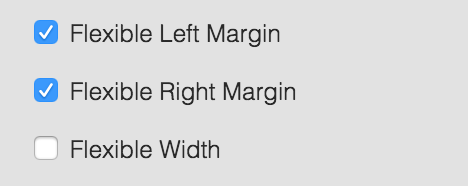

Try to do that for the white layout block that has "Repeat on posts Labeled post" first. Since both of its margins have the same size in
the Artboard, making both flexible is going to make them shrink and grow equally, keeping your content nicely centered. Again, refresh `ide50-yourusername.cs50.io/` to see that it worked.

Since the "Repeat on posts Labeled post" block has flexible margins, its parent (and their parents) automatically get flexible width, which means that the big gray background block will also fit the whole screen width automatically. It won't fit the whole screen height by default, however. In order to do that, select the gray background block and check `Is Full Window Height`.

Let's make the thin line that separates the header from the content resize as well. Simply select it and check its `Flexible Width` attribute.

Finally, click on the block that has a pencil icon at the top right of the page and check its `Flexible Left Margin` property. This will enable the empty space between this block and the `myFace` logo to resize, which will pin the pencil icon to the right hand side of the page.

Now if you go back to your running app, everything should be resizing as expected.

7. Adding Links
-

To finish our first page. let's create a couple links. Click on the block with the `myFace` logo and set its `Link` attribute to `/`.

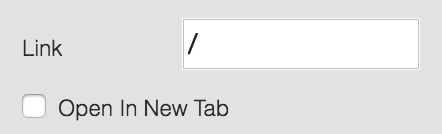

Feel free to do the same with the Smiley face block. Both of them should be links to the route `/` which is this very page that you just created. Finally make the little pencil icon on the right of the header a link to `/new_post`. What is `/new_post`? Well, it's a route to the new page that we're about to create...

8. Letting the user create posts
-

Now go back to the dashboard at [https://pagedraw.io](https://pagedraw.io) and click on the little copy icon on the left of the page named `index`. This will create a new page `index_copy` that is a copy of `index`.

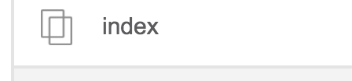

Start editing the new page and make sure you change its `File Path` from `~/workspace/project/templates/index.html` to `~/workspace/project/templates/new_post.html`. If you forget to do this, both pages will try to write to the same file in Cloud9 and you'll get weird results.

Now delete the "Repeat On posts Labeled post" block as well as all blocks inside of it. We will replace it by a form. Add a white `Layout` block, two `Text Input` blocks, and a blue `Button` block, per the below

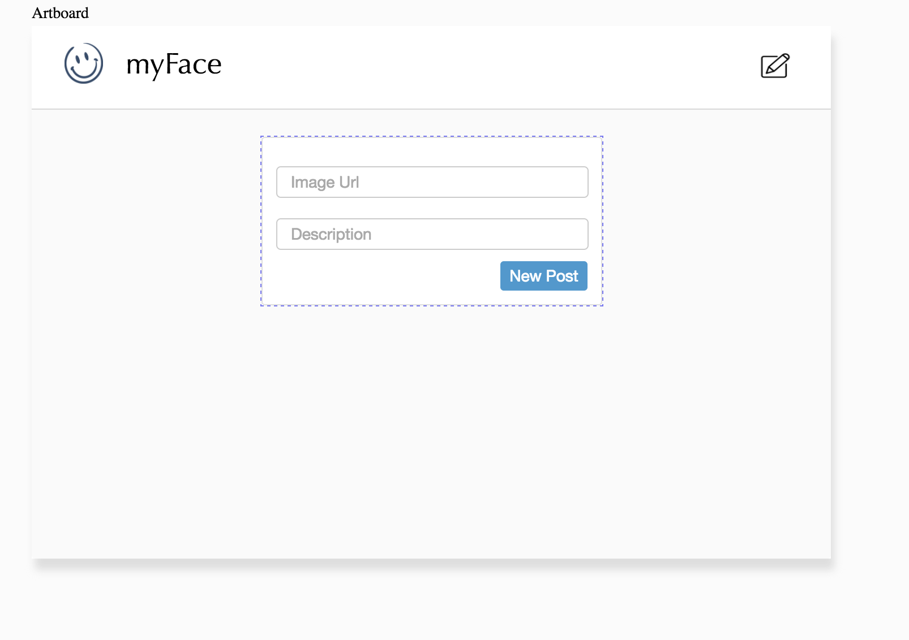

Again, I used a border of 1px and color `#DFDFDF` around the white layout block as well as a corner roundness of 3. For the button, I used a fill color of `#5398CC` with no border and text color `#FFFFFF`.

For the text inputs, add `Ref`s of `img_src` and `description`. This is going to make the values typed in by the user accessible by the backend via `request.form.get("img_src")` and `request.form.get("description")`, respectively. Also make their `Placeholders` `Image Url` and `Description`, respectively. This will show a placeholder before the user types anything.

Finally we need to turn the white layout block you just added into a form block. Simply add `/new_post` into its `Form Action` and `POST` into its `Form Method` per the below. Also, don't forget to specify `Flexible Left Margin` and `Flexible Right Margin` on the white layout block as well, to center it.

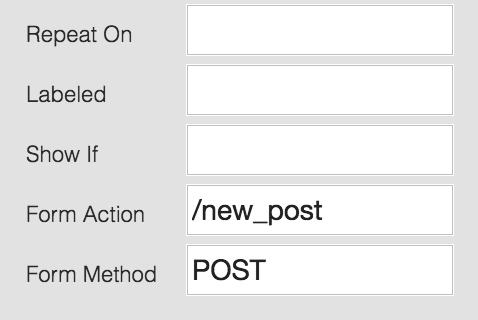

Now whenever a user clicks on the `New Post` button, this form will submit to the route `/new_post` using the method `post.` We have to handle that in the backend by adding the following to `application.py`

```
@app.route("/new_post", methods=["GET", "POST"])
def new_post():
    if request.method == "GET":
        # Show new_post form
        return render_template("new_post.html")
    else:
        # Add new post to database
        db.execute("INSERT INTO posts (img_src, description, time) \
            VALUES(:img_src, :description, datetime())",
            img_src=request.form.get("img_src"), description=request.form.get("description"))
        return redirect(url_for("index"))
```

This code does two things. If the user accessed the route `/new_post` via GET, it renders the template you just created. If the user accessed the route `/new_post` via POST (i.e. the user submitted a form), it adds a new post to the database. This is very similar to what you did in Pset7. Again, Flask/Python doesn't care that you're using Pagedraw, so everything you did in `application.py` in Pset7 should work here in the exact same way.

If you now head to `ide50-yourusername.cs50.io/new_post`, both of your pages should be working! Congratulations on finishing your first Pagedraw app. =)


9. Getting help
-

We're pumped that you're interested in using Pagedraw for your CS50 Final Project. You should join our
[Facebook User group](https://www.facebook.com/groups/332815050435264/) to request for features and get help.

Right now we have a lot of awesome features that are sometimes undocumented (like support for over 10 different languages/frameworks). Feel free to ask questions in the above group or directly to `team@pagedraw.io` and we are happy to help you!

