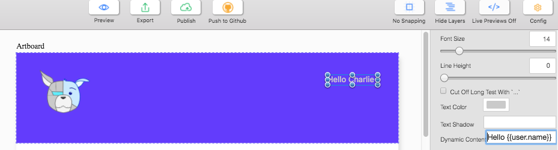
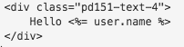

Hello World in Pagedraw
=

<!-- This is a bad hello world example. Let's think of something better -->

Anything you draw in Pagedraw can be automatically compiled to HTML/CSS code that works. Period. However, one of the first questions of our users is often **"How can I add dynamic content - content that comes from a database, for example - in Pagedraw?"**

Well if you use handlebar notation (`{{'Hello World'}}`) anywhere in Pagedraw, we go into "backend mode" compiling whatever is
inside of the double curly braces into your language/framework of choice.

A simple example is if you want to say "Hello Charlie" in a page, where "Charlie" should of course be substituted by the dynamic username of
your esteemed logged in user. To accomplish this, we simply type `Hello {{username}}` into the Dynamic Content property
of the text block that has "Hello Charlie".

The compiler then substitutes the text in the text block by whatever is inside of "Dynamic Content", transforming the
handlebar notation into your language/framework of choice. In, say Ruby on Rails, this is the resulting compiled code:

