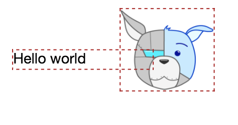

Frequently Asked Questions
=

Can I create a full app (frontend + backend) without leaving Pagedraw?
-

No. Pagedraw is the place where your frontend lives, but that means you still need to develop a backend in order to bring your app to life. We
are very proud to be completely agnostic to whatever backend you choose. In fact, making a backend for an app made with
Pagedraw should be exactly the same as making a backend for an
app made with handwritten frontend code.

The Pagedraw philosophy is that:

*The backend is the part of your application responsible for __generating and mutating__ data.*

*The frontend is the part of your application responsible for __displaying__ data.*

And we can automatically generate code for the second part, but not the first.

How do I connect the frontend made in Pagedraw to my backend?
-

Ah. Starting to get to the fun part. :)

Check out our [example](cs50_project.md) to start building dynamic views using Pagedraw.

Can I manually edit the code that Pagedraw exports?
-

Technically you can, but that's not the best way to use Pagedraw to its full potential. If you make an edit to the exported
code outside of Pagedraw and then decide you want to change your UI within Pagedraw, we have no way of knowing about
your edit outside of Pagedraw, so once you export your new UI, that edit will be lost.

The best way to use Pagedraw is to make sure that all of your UI work is done within our tool.

Can I build anything using Pagedraw?
-

We are hard at work to ensure the answer to this question is __yes__. We want Pagedraw to be at least as
powerful as models such as HTML and CSS but there are still some things that we don't support quite yet.

Whenever you find one of these things you can always
add `custom code` to any block. In our compilation process, we are essentially going to replace that block and all of
its children by whatever HTML/CSS (or PHP, React, etc) code you specify.

Why do I see dashed red lines around my blocks?
-

Pagedraw doesn't fully handle overlapping blocks yet, since the desired layout behavior is often ambiguous in this case.
We will compile code that works for overlapping blocks, but the flow of the app might break especially in scenarios
involving dynamic content that makes the parent element resize.

As a rule of thumb, most apps should not have any overlapping blocks right now (which is why we flag them with
dashed red lines). If you'd like to have elements overlapping in your app, you should consider making them a single
image instead.

If a developer makes any changes to the exported file, can a designer then continue editing in Pagedraw without losing the dev's changes?
--

Any work on the frontend should be done in Pagedraw, and re-pushed to code when ready; not done by corrupting the generated file.  Developers should never modify the code Pagedraw generates; that would defeat the purpose.  Developers can set up Pagedraw-generated code to connect to their backend in our editor (eg. the "Repeat On" field which tells a repeated block where to look for its data source) where needed.  With our Github integration, the code generator will only update the parts of files that have need to be changed.

Pagedraw is a compiler.  Looking at how people use the C language, they don't modify the assembly code GCC writes from the C code they hand it.  Developers should never want or need to modify the generated code.

If you don't like the assembly code GCC generates, you would write a separate file of just assembly code for the specific module you want to have custom assembly code for, and have GCC link it with the rest of the C project.  You wouldn't have GCC generate the first pass from C, and then tweak it by hand.

We take the same approach for Pagedraw.  An early example of this that we have implemented is the "Custom Code" field every block has at the bottom of it's sidebar.  With it, you can specify 100% custom code for any piece of the screen.  Pagedraw doesn't know or care what you put in there, we will literally just copy it right into our generated code in the right place.  This way, if you ever want to change the way Pagedraw does something, you can just give us exactly what you'd like the generated code for it to be.

I want to emphasize that we don't think this should be used frequently.  Pagedraw *should* always generate code that does what you need to begin with for any features we support, and we plan to support the ability to do anything you can do with html and css.  That's our promise.  However, in order to build trust with our users, we're building the Custom Code feature and other "escape hatches" as a way for users to take control when they feel uncomfortable.  These can also be useful when you want to do things beyond what html and css can do, like when you require javascript, or if there's anything Pagedraw can't do yet.  Another use case we expect to be common is dropping in existing legacy code to a Pagedraw page.

Similar escape hatches to legacy code were an important part of React's adoption (and growth) story.  We're learning from React both in strategy, and in practice by integrating with existing hand-coded React components.  An upcoming feature (which you can simulate with Custom Code, albeit ham-handedly,) is dropping in React components written elsewhere in your codebase directly into pages made with Pagedraw.  This way if you ever want to change the code Pagedraw writes for a component of your page, you can take it out of Pagedraw and handwrite it in a React file in your project, and Pagedraw will connect it into your Pagedraw project the same way GCC would connect handwritten assembly to a C project.
